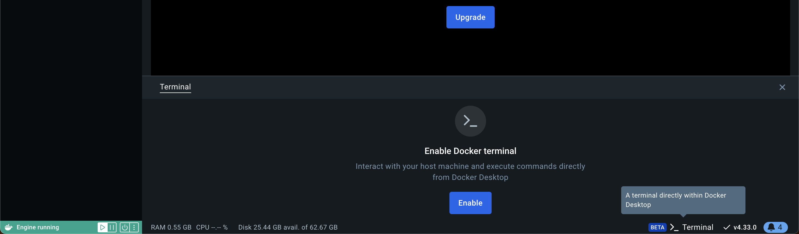
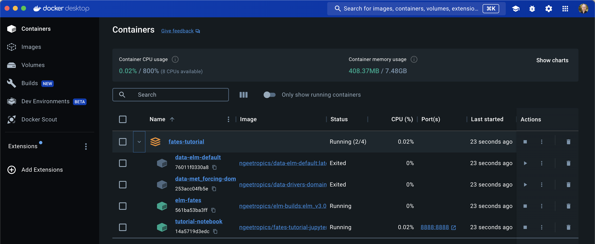
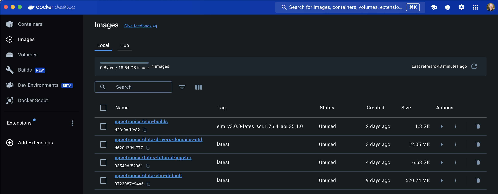

# Tutorial Setup

## Overview

This tutorial utilizes Docker to provide the user a simplified method of setting up the necessary software to run FATES on a user's local machine, such as a laptop.  Typically, FATES development and usage is conducted on large high performance computing clusters or supercomputers to enable global simulations.  However, FATES can also be run regionally and for specific sites, the latter of which is tractable on smaller machines.  This tutorial will orient new users to the FATES terminology and usage through simulation of individual sites.

Given that FATES must be run as one of many components within the context of a larger earth system model, it is necessary for the user to become familiar with this "host" model and the infrastructure that accompanies it.  FATES typically interacts with the native land model of the given earth system model, and as such we will frequently refer to the "host land model" or HLM, throughout this tutorial.  Setting up such a large host land model can be daunting given the number of required software libraries and packages that the model has as dependencies for building and running simulations.  Such an effort is further complicated by the variety of operating and hardware systems that the model could be deployed upon.  As such, we have developed this tutorial to be portable with the minimum amount of necessary setup as possible and to provide for portability to the greatest extent possible.  This is accomplised by the use of software containers.

## A brief introduction to containerization

A software container is an isolated process on your local machine that runs with all the necessary libraries, packages, files, etc. necessary to run a specific software program.  These process are run and orchistrated via an container application, of which there are a number of implementations available.  In this tutorial we will be using Docker Desktop.  Historically, containers have been developed to distribute small application services developed on one platform across a number of different operating systems and hardware architectures.  This provides software developers the ability to more easily deploy their application by offloading cross-platform compability to the container application.  

If you are familiar with [virtual machines](https://en.wikipedia.org/wiki/Virtual_machine) (VMs) you will find similarities between this concept and [containerization](https://en.wikipedia.org/wiki/Containerization_(computing)).   The main difference being that VMs use software virtualization to emulate the hardware of a given platform typically to run a complete operating system, where as containers only virtualize the OS or application with the minimal set of libraries and dependencies necessary to run the containerized application.  As such VMs tend to be larger in size and interactive in scope, whereas containers are typically smaller and run obfucated from the user.  Given that we only need to provide application virtualization for this tutorial, we provide the tutorial via containerization.

### Glossary of terms

[*Image*](https://docs.docker.com/get-started/docker-concepts/the-basics/what-is-an-image/): A pre-built binary from a Dockerfile recipe.

*DockerHub*: an online [registry](https://docs.docker.com/get-started/docker-concepts/the-basics/what-is-a-registry/) of images that are available to be downloaded and run within Docker.

[*Container*](https://docs.docker.com/get-started/docker-concepts/the-basics/what-is-a-container/): an running instance of an image that is an isolated software process.  Container processes are *ephemeral* and as such, exiting a container process destroys any updates that may have occured in that isolated space.

*Volume*: the interface between a running container and storage space to hold container inputs and/or outputs.  A volume can be "mounted" to an existing directory of local storage or can be a "named" storage space isolated from the local user.  Volumes provide a way to persist data that is produced by container processes.

[*docker compose*](https://docs.docker.com/get-started/docker-concepts/the-basics/what-is-docker-compose/):  An application that helps orchastrate running multiple containers and volumes in concert with each other.

### Docker Tutorial Environment Orientation

We have designed the materials to use two main Docker images, one for running the FATES within the host model, which is built on a precursor image where all of the required libraries for the host model are already compiled (e.g. netCDF, HDF5, Python), and a second that is used to analyze the FATES simulation output in JupyterLab.  The tutorial utilizes a Docker container orchastration program known as Docker Compose which will run both containers at the same time and coordinate sharing of inputs and outputs.  This allows a user to be running simulations while also exploring the output of a previous simulation in Jupyter notebooks. 

Next we provide the instructions for setting up and running the Docker tutuorial environment.  If you have any questions or run into issues with this setup, please reach out the fates team by posting a question on the [FATES tutorial Github discussion board](https://github.com/NGEET/fates-tutorial/discussions).

## Docker environment setup

### 1. Download and install Docker Desktop

Go to the Docker website quick start guide and follow the instructions: [https://docs.docker.com/docker-hub/quickstart/](https://docs.docker.com/docker-hub/quickstart/)

The quick start guide will instruct you to create a Docker ID and sign up for [DockerHub](https://hub.docker.com/) in the first step.  The NGEE-Tropics FATES tutorial team uses the DockerHub registry to hold the images necessary to run the tutorial containers.  It will also provide a link with instructions to download [Docker Desktop](https://docs.docker.com/desktop/), which is available for MacOS, Windows, and Linux operating systems.  Make certain to pull and run the "Hello World" container to make certain that the installation was successful and that you can pull images from the DockerHub registry.  You do not need to complete step 5 in the quick start which teaches you how to build and push a container.  This capability will not be necessary for this tutorial.

### 2. Download the [FATES tutorial repository](https://github.com/NGEET/fates-tutorial/)

In this tutorial, we provide a repository with can be downloaded to your local machine, with a recommended directory structure provide ahead of time to streamline the setup.  All activities for the tutorial will take place within directory.

From the [fates-tutorial](https://github.com/NGEET/fates-tutorial/) github website, find the link to download the repository under the green "code" button as shown below:


This can either be done by downloading the repository or using `git` to clone the respository.  This tutorial will not make use of `git` so you do not have to be familiar with its usage.

### 3. Create a `.env` file from the template file

The Docker setup for this tutorial makes use of a file to set environment variables necessary for running the containers.  Specifically, the container needs to know where the inventory data for your site is stored on your local machine.  The repository contains a template file named `env-template`, which has the following contents:

```
# Instructions
# 1. Add the local directory corresponding to where you have located your input data.  Leave "jovyan" as NB_USER.
# 2. Save the file and rename the file to ".env"
INPUT_DATA=
NB_USER=jovyan
```

Using a text editor of your choice, open the file and follow the instructions within updating its contents as approprite, making sure to save a copy of your changes as a new file named `.env`.

### 4. Test start the tutorial containers

1. *Start Docker Desktop and login*

   Logging into Docker Desktop will provide you access with downloading the necessary images from DockerHub.

2. *In a terminal, change directory to the top of* `fates-tutorial`

   The `fates-tutorial` directory contains a file called `docker-compose.yml` that provides the Docker application with instructions on what docker images to download from DockerHub and how to coordinate which local directories are mapped inside the container when run.

   *Note*: While you are encouraged to use the terminal application for MacOS/Linux or [Windows Powershell](https://learn.microsoft.com/en-us/powershell/), Docker Desktop provides an integrated terminal for running commands as well.  You can access the integrated terminal by clicking on the "Terminal" found next to the desktop version number in the lower right hand corner of the Desktop application.  You may need to enable the terminal if it is not available by default:
   

3. *To start the tutorial containers, run the command* `docker compose up -d`

   Upon running `docker compose up -d` you should see something similar to the following:
   ```
   user@hostmachine fates-tutorial % docker compose up -d
   [+] Running 64/22
    ✔ landmodel 21 layers [⣿⣿⣿⣿⣿⣿⣿⣿⣿⣿⣿⣿⣿⣿⣿⣿⣿⣿⣿⣿⣿]      0B/0B      Pulled                                             12.3s 
    ✔ notebook 33 layers [⣿⣿⣿⣿⣿⣿⣿⣿⣿⣿⣿⣿⣿⣿⣿⣿⣿⣿⣿⣿⣿⣿⣿⣿⣿⣿⣿⣿⣿⣿⣿⣿⣿]      0B/0B      Pulled                                   1.7s 
    ✔ elmdata 3 layers [⣿⣿⣿]      0B/0B      Pulled                                                                   1.7s 
    ✔ sitedata 3 layers [⣿⣿⣿]      0B/0B      Pulled                                                                  3.3s 
    ```
    Here docker is downloading, or "pulling", the necessary images from DockerHub to run the containers. Upon successfully pulling the images, the containers will start running:
    ```
   [+] Running 4/9
    ⠦ Network fates-tutorial_default         Created                                                                  3.6s 
    ⠦ Volume "fates-tutorial_modeloutput"    Created                                                                  3.6s 
    ⠦ Volume "fates-tutorial_elm-inputdata"  Created                                                                  3.6s 
    ⠦ Volume "fates-tutorial_site_data"      Created                                                                  3.6s 
    ⠦ Volume "fates-tutorial_bci_inventory"  Created                                                                  3.6s 
    ✔ Container elm-fates                    Started                                                                  3.4s 
    ✔ Container data-elm-default             Started                                                                  3.3s 
    ✔ Container data-met_forcing-domains     Started                                                                  3.3s 
    ✔ Container tutorial-notebook            Started                                                                  3.5s 
   ```
   From this output you can see that Docker has successfully started up four containers:
   
   - `elm-fates`: this container holds the host land model and fates
   - `data-elm-default`: this container provides a set of necessary files that the host land model requires by default
   - `data-met_forcing-domains`: this container provides meterological forcing data, domain and surface data sets necessary for the tutorial
   - `tutorial-notebook`: this container holds the jupyter notebook to run the lessons associated with the tutorial

   You can confirm that the containers are running by looking at the Docker Desktop GUI container pane:
   


4. *To teardown the tutorial containers, run the command* `docker compose down`

   This command will make sure to cleanly shutdown the running containers and remove them.  Typically, the `elm-fates` container takes the longest to shut down. You should see the terminal return something like:
   ```
   user@hostmachine fates-tutorial % docker compose down
   [+] Running 5/5
   ✔ Container data-met_forcing-domains  Removed                                                                     0.0s 
   ✔ Container elm-fates                 Removed                                                                    10.1s 
   ✔ Container data-elm-default          Removed                                                                     0.0s 
   ✔ Container tutorial-notebook         Removed                                                                     0.3s 
   ✔ Network fates-tutorial_default      Removed                                                                     0.1s 
   ```
   Note that the images downloaded to run the containers are still available and have not been removed so they will not need to be pulled again the next time the `docker compose up -d` command is run.  This can be confirmed if you go to the Docker Desktop user interface and select the "Images" section in the left side bar.
   

Congratulations, the Docker fates tutorial environment has been successfully set up! 
