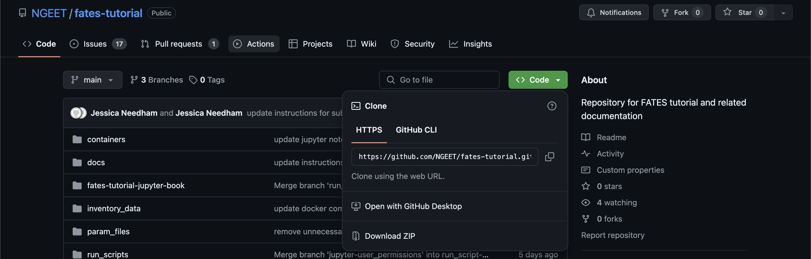

# Tutorial Setup

## Overview

This tutorial utilizes docker to provide the user a simplified method of setting up the necessary software to run fates.

Docker is an open-source project that allows programmers to deploy their applications in a sandbox (called containers) to run on the host operating system (Linux). Docker allows programmers to package an application with all of its dependencies (code, data, etc) into a standardized unit that other users can work with despite running different types of operating systems.

## Docker environment setup

### 1. Download and install Docker Desktop: https://docs.docker.com/docker-hub/quickstart/

The quick start guide will instruct you to create a Docker ID and sign up for [DockerHub](https://hub.docker.com/) in the first step.  The NGEE-Tropics FATES tutorial team uses the DockerHub registry to hold the images necessary to run the tutorial containers.  It will also provide a link with instructions to download [Docker Desktop](https://docs.docker.com/desktop/), which is available for MacOS, Windows, and Linux operating systems.  Make certain to pull and run the "Hello World" container to make certain that the installation was successful and that you can pull images from the DockerHub registry.  You do not need to complete step 5 in the quick start which teaches you how to build and push a container.  This capability will not be necessary for this tutorial.

### 2. Download the tutorial repository: https://github.com/NGEET/fates-tutorial/

In this tutorial, we provide a repository with can be downloaded to your local machine, with a recommended directory structure provide ahead of time to streamline the setup.  All activities for the tutorial will take place within directory.

From the github website, find the link to download the repository under the green "code" button as shown below:



This can either be done by downloading the repository or using git to clone the respository.  This tutorial will not make use of git so you do not have to be familiar with its usage.

### 3. Create a `.env` file from the template file

The Docker setup for this tutorial makes use of a file to contain environment variables necessary for running the containers.  Specifically, the container needs to know where the inventory data for your site is stored on your local machine.  The repository contains a template file named `env-template`, which has the following contents:

```
# Instructions
# 1. Add the local directory corresponding to where you have located your input data.  Leave "jovyan" as NB_USER.
# 2. Save the file and rename the file to ".env"
INPUT_DATA=
NB_USER=jovyan
```

Using a text editor of your choice, open the file and follow the instructions within updating its contents as approprite, making sure to save a copy of your changes as a new file named `.env`.

### 4. Test start the tutorial containers

1. Start Docker Desktop and login
2. In a terminal, change directory to the top of the fates-tutorial repository
3. To start the tutorial containers, run the command `docker compose up -d`
4. To teardown the tutorial containers, run the command `docker compose down`

## Introduction to containers

### Docker Orientation

- What is Docker Desktop? Docker Desktop "enables developers to locally build, share, and run containerized applications and microservices. Docker Desktop includes Docker Engine, Docker CLI client, Docker Build/BuildKit, Docker Compose, Docker Content Trust, Kubernetes, Docker Scan, and Credential Helper. Docker Desktop is for Mac and Windows and includes the Docker Dashboard for working with local and remote container images, Dev Environments and more new features are being delivered every month such as Volume Management."
- You can learn more about containers here: https://www.docker.com/resources/what-container/

### Why containers?
